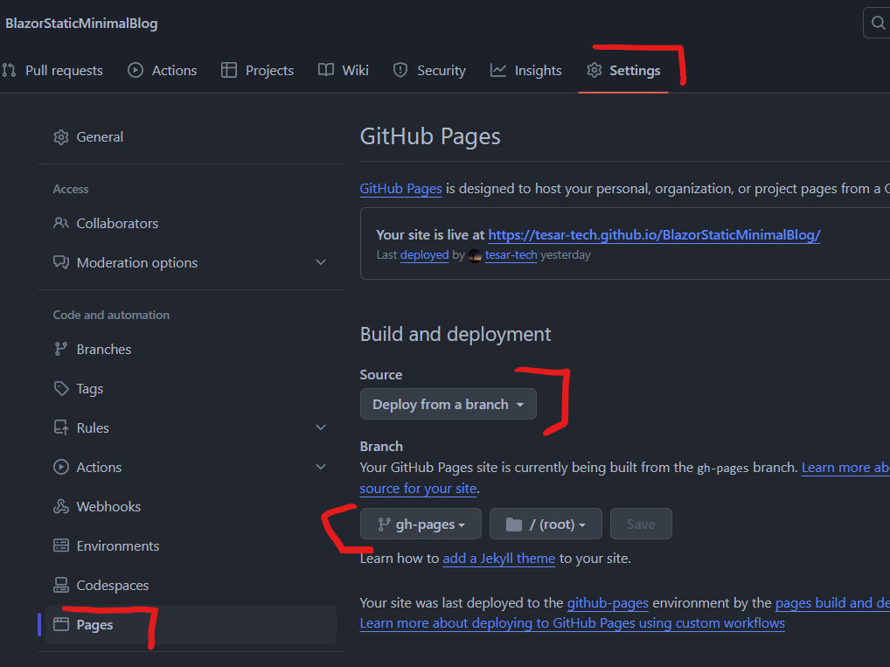

# How to deploy 

Since the output of BlazorStatic are just plan .html files and assets, you can deploy it fairly easily. You can use GitHub Pages, Azure Static Web Apps, Netlify, ...

## GitHub Pages

- Build and run the app
- Use `JamesIves/github-pages-deploy-action@v4` to publish the output folder to GitHub Pages. The way it works is that it will create orphaned branch `gh-pages` and push the content of the output folder there. 

    ```yml
    - name: Run webapp and generate static files
    run: |
        dotnet run --project path/to/yourProject.csproj  --configuration Release

    - name: Deploy to GitHub Pages
    uses: JamesIves/github-pages-deploy-action@v4
    with:
        folder: path/to/output
    ```
- Set the GitHub Pages to use `gh-pages` branch as source. 
  
- Don't forget to add `.nojekyll` file to your `wwwroot` folder, otherwise GitHub Pages will ignore folders starting with
underscore `_` (e.g. `_content`, which is used for serving static content from RCL). [more info](https://github.blog/2009-12-29-bypassing-jekyll-on-github-pages/)
- Check the whole pipeline [here](https://github.com/tesar-tech/BlazorStaticMinimalBlog/blob/master/.github/workflows/publish-to-ghpages-and-nuget.yml)


## Netlify (Using GitHub Actions to generate the output)

You can use GitHub Actions to build and deploy the app to Netlify.

- Build and run the app in CI/CD pipeline
- Create orphaned branch (e.g. `netlify-deploy`) and push the output folder there.
- Go to Netlify and target the deployment to the `netlify-deploy` branch.
- Check the whole pipeline [here](https://github.com/tesar-tech/zodoc/blob/master/.github/workflows/publish-zodoc.yml) (mainly the last steps).

## Netlify (Using Netlify build script to generate the output)

In this scenario, we don|t need GitHub Actions at all. The whole process is handled by Netlify.

See the result: https://blazorstatic.netlify.app/ 
  
### Step 1. Add the 'netlify.build.sh'

For this example file is placed in `.github/workflows/netlify.build.sh`. This script will be used by Netlify to build the project.

```
#!/usr/bin/env bash
set -e

## install latest .NET 8.0 release
pushd /tmp
wget https://dotnet.microsoft.com/download/dotnet/scripts/v1/dotnet-install.sh
chmod u+x /tmp/dotnet-install.sh
/tmp/dotnet-install.sh --channel 8.0

## install and run tailwind (if needed)
wget https://github.com/tailwindlabs/tailwindcss/releases/latest/download/tailwindcss-linux-x64
chmod +x /tmp/tailwindcss-linux-x64
popd
pushd BlazorStaticWebsite
/tmp/tailwindcss-linux-x64 --input ./wwwroot/app.css  --output ./wwwroot/app.min.css  --minify
popd

## run the project to build the static files. Ensure launch profile ASPNETCORE_ENVIRONMENT is set to Production!
dotnet run --launch-profile "netlify" --project ./BlazorStaticWebsite/BlazorStaticWebsite.csproj
```

### Step 2. change the permissions for the build script so that netlify can run it.

```
git update-index --chmod=+x ".github/workflows/netlify.build.sh"
```

### Step 3. Add a launch profile to launchSettings.json

-   !!!! Important - ensure the environment is set to Release or netlify will build forever !!!!

```
 "netlify": {
   "commandName": "Project",
   "dotnetRunMessages": true,
   "launchBrowser": true,
   "applicationUrl": "http://localhost:5049",
   "environmentVariables": {
     "ASPNETCORE_ENVIRONMENT": "Release"
   }
 }
 ```

### Step 4. Setup the netlify build settings.

For this site:

- **Runtime**: Not set
- **Base directory**: `/`
- **Package directory**: Not set
- **Build command**: `./.github/workflows/netlify.build.sh`
- **Publish directory**: `/BlazorStaticWebsite/output`
- **Functions directory**: `/netlify/functions`


## Azure Static Web Apps
[**TODO**](https://github.com/tesar-tech/BlazorStatic/issues/1) 
Shouldn't be complicated, but I haven't tried it yet.

