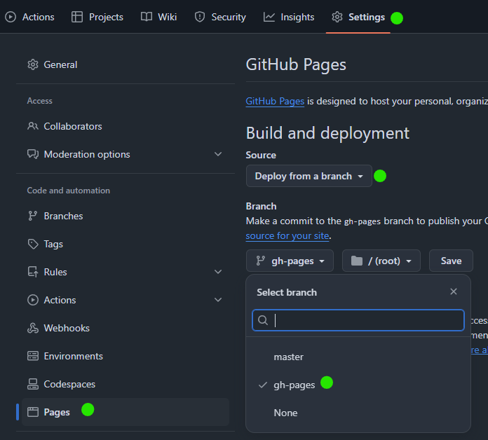

# 


[
](https://discord.gg/DsAXsMuEbx)
[](https://www.nuget.org/packages/BlazorStatic/)
[](https://github.com/tesar-tech/BlazorStatic/actions/workflows/publish-to-ghpages-and-nuget.yml)
[](https://app.netlify.com/sites/blazorstatic/deploys)


Embrace the capabilities of Blazor on .NET 8 to craft static websites.

Transform your Blazor app into a static site generator.

# 🔧 How does it work?

Like any .NET Blazor app! That's the main point. If you know how to build a Blazor app, you can transfer it to HTML files easily.
**BlazorStatic** will help you with that. It can also help with processing markdown files.

> Website for BlazorStatic is a feature-rich example of the library. Check the [source code](https://github.com/tesar-tech/BlazorStatic/tree/master/BlazorStaticWebsite). 

Upon running your app, **BlazorStatic** fetches the pages' HTML with `HttpClient`, outputs HTML files and assets to the `output` folder, which you can deploy to any static hosting service.

There are many defaults to keep usage simple, but you can configure it extensively. For example, you can match your YAML front matter in markdown files (which can be reused from other static site generators).


# 🚀 Getting Started

You can start using BlazorStatic in three ways, depending on your setup and intended use. 
## 👑 Recommended Way

Install the BlazorStatic templates:

```sh
dotnet new install BlazorStatic.Templates
```

This adds new options to your `dotnet new` template list. Then create a new project using:

```sh
dotnet new BlazorStaticMinimalBlog -o MyBlazorStaticApp 
```

This creates a `MyBlazorStaticApp` folder and project. It's a standard .NET 8 Blazor app with the BlazorStatic package installed, including a few predefined components, styles, and a blog post with sample data.

Run the app using `dotnet watch`. This will launch the app, allowing you to view it live, while also generating static HTML files in the `output` folder.

From here, you're ready to explore the project, add content, create new pages, and more.

- Markdown files are located in the `Content/Blog` folder.
- A `.gitignore` file is included with standard .NET recommendations and ignores the `output` folder.
- The template also includes a `.github` folder with a GitHub action for building and deploying to GitHub Pages. See the Deploying section below.
- You can customize anything. For further details, see [this document](./BlazorStaticWebsite/Content/Docs/new-start.md), which explains everything in more depth.

## 🏃‍➡️ Quickest Way

Use [BlazorStaticMinimalBlog](https://github.com/tesar-tech/BlazorStaticMinimalBlog) as template (the big green button).

It will copy all the content and run the GitHub action for you. After it runs, go to settings and turn on GitHub pages:



Your page is ready now! 

## 🛠️ Custom Way

If you want to fully understand how BlazorStatic works or if you have an existing project where you'd like to integrate the BlazorStatic library, start from scratch. Check out [this document](./BlazorStaticWebsite/Content/Docs/new-start.md) for guidance.

# 🧩 Features

- Work with Blazor as you are used to.
- Easily parse and consume markdown files.
- Support for custom YAML front matters.
- Automatically discovers pages among Razor files.
- Ability to add/remove pages as needed.
- Works with all CSS frameworks and themes.
- Easy to deploy with CI/CD pipeline.
- Supports HotReload
- Has `dotnet new` template 


# 📦 Deploying

You can deploy the `output` folder to any static hosting service, such as GitHub Pages, Netlify, Vercel, Azure Static Web Apps, etc.

Detailed instructions are [here](./BlazorStaticWebsite/Content/Docs/deployment.md).

# 📊 Samples

| Description                                                  | Source                                                                               | Live                                                          |
| ------------------------------------------------------------ | ------------------------------------------------------------------------------------ | ------------------------------------------------------------- |
| Page about BlazorStatic (this repo contains the code itself) | [source](https://github.com/tesar-tech/BlazorStatic/tree/master/BlazorStaticWebsite) | [live](https://tesar-tech.github.io/BlazorStatic/)            |
| Minimal blog                                                 | [source](https://github.com/tesar-tech/BlazorStaticMinimalBlog)                      | [live](https://tesar-tech.github.io/BlazorStaticMinimalBlog/) |
| Zodoc - image processing and deep learning sample            | [source](https://github.com/tesar-tech/zodoc/)                                       | [live](https://zodoc.tech/)                                   |
| ❓ Add your page here!!!                                      |                                                                                      |

# 🤝 Contributions

Contributions are highly encouraged and appreciated. If you find something missing, unclear, or encounter an issue with the code, I warmly welcome your input. Feel free to:

- Create a new [issue](https://github.com/tesar-tech/BlazorStatic/issues) or submit a PR.
- Contact [me](https://github.com/tesar-tech/) directly for any queries or suggestions.
- Ask questions or start a discussion on the [Blazor Community Discord server](https://discord.gg/DsAXsMuEbx).
